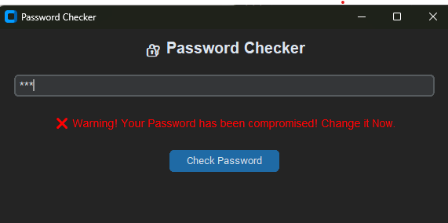

# PyPass
A sleek, Python‑powered desktop app for checking if your passwords have been compromised and evaluating their strength — all in a clean, modern UI built with customtkinter.
# 🔐 PyPass — Modern Password Leak & Strength Checker

PyPass is a sleek, Python-powered desktop app that helps you check if your password has been compromised and evaluates its strength — all in a clean, modern UI built with [`customtkinter`](https://github.com/TomSchimansky/CustomTkinter).

## ✨ Features

- 🔍 **Compromise Detection**  
  Instantly checks your password against a local breach list.  
  *(Optional)* Upgrade to use the [HaveIBeenPwned API](https://haveibeenpwned.com/API/v3) for real-time results.

- 📊 **Strength Meter**  
  Rates password complexity in real time.

- 🎨 **Modern Interface**  
  Dark mode, rounded buttons, and responsive layout.

- 🛡 **Privacy-First**  
  All checks happen locally unless you opt-in for API lookups.

---

## 📸 Screenshot


---

### 🛠 How It Works
**Enter your password:**  
<input type="password" placeholder="Enter password" aria-label="Password" />

**Result:**  
- ✅ **Safe** — This password was **not** found in the local breach list.  
- ❌ **Compromised** — This password **was** found in the breach list. Change it immediately.

---

### Notes
- The check is performed **locally** (no password leaves your device).  
- Use a **unique password** per site and enable **2FA** where possible.  
- Consider a password manager to generate and store long random passwords.

**Result Display —**
✅ Safe: Password not found in the breach list.
❌ Compromised: Password found — change it immediately.

```md
## 🔒 Security Notes

- Your password is **never stored or sent anywhere** unless you enable **API mode**.  
- If using the **HaveIBeenPwned API**, the password is **hashed locally** and checked using **k-anonymity** — the full password is **never transmitted**.
```

## 📦 Future Enhancements

- 🌐 Live API integration with **HaveIBeenPwned**  
- 📂 Bulk password file checking  
- 📈 Advanced strength analysis with **entropy calculation**  
- 🌙 Light/Dark mode toggle  


## 🚀 Getting Started

### 1. Clone the Repository
```bash
git clone https://github.com/miltonbiswas/PyPass.git
cd PyPass
```
### 2. Create a Virtual Environment (Recommended)
```bash
python -m venv .venv
.venv\Scripts\activate   # Windows
source .venv/bin/activate  # macOS/Linux
```

### 3. Install Dependencies
```bash
pip install -r requirements.txt
```

### 4. Prepare the Compromised Password List
```bash
Download rockyou.txt from google.
```

### 5. Run the App
```bash
python PyPass.py
```


